### 0 小组成员&分工

| 成员姓名   | 负责内容                                                   | 学号         |
| ------ | ------------------------------------------------------ | ---------- |
| 组长：王凯雯 | Unity前端布局，Unity Tcp编写，Agent框架编写，小模型训练，小模型部署，小模型评估，问卷制作 | 1120221327 |
| 组员：游书欣 | 数据收集，LoRA原理解释，ppt制作                                    | 1120231576 |

### 1 项目介绍

>VTuberAgent是一个基于AI技术的，**从后端智能生成到前端沉浸式交互**的虚拟主播全流程自动化工具，能够智能规划、生成并管理VTuber的日常运营任务。项目集成了任务规划、内容生成和直播互动三大核心模块，通过自动化流程显著提升VTuber内容创作效率。后端通过Tcp协议与Unity前端交互，可以实现时间控制，主播状态控制，主播动作控制等等。和VTuber的交流由微调过后的==个性化小模型==支撑，除此之外；其他所有日常流程全程由qwen-plus大模型提供支撑。

>借助 **VTuberAgent**，虚拟主播不再只是「角色」，而是真正的 **24 小時自运营 AI 实体**——能自行规划一天的工作安排、理解工作需求、与 Unity 前端实时互动，并且在沒有人工介入的情況下完成从企划、内容产出到直播的全链路工作。

- **全流程自动化运营**：从查收公司邮件、封面制作、推特发布到直播，一切行为都由AI自主判断并排程。
- **沉浸式 Unity 前端互动**：透过 TCP 实现低延迟双向通信，实现低延迟双向通信，AI 可以及时控制 VTuber的表情、场景与内容变化。
- **模组化 Agent 生态**：包括公司、游戏商城、直播平台等多个 AI 协作單位，使整个虚拟直播世界具备“社会系统”般的运作性。
- **个性化 Agent 模型**：除了全流程自动之外，VTuber的直播由LoRA训练过后的，具有主播独特“人格”的小模型支持，更加具有个性化。

### 2 智能体集群（Cluster）

>VTuberAgent 的核心是一個 ==多智能体协作的虚拟主播生态系统==。每個智能体（Agent）都具备独立的推理能力、任务目标与行为逻辑，它们彼此协作、信息交互，共同支撑起整个虚拟主播的 24 小时连转。

>这不只是一个 AI 模型，而是一群拥有有专业分工的“虚拟同事”。

#### 2.1 三大核心智能体分工

##### 2.1.1 VTuberAgent

>负责 VTuber 的全部日常行为，是真正的「自运转 AI 主播」。

**能力：**
- 自主安排并调整每日行程
- 自主生成推文、封面文案、直播标题、项目邮件
- 与 Unity 前端互动（背景、表情、转场）
- 对各类事件做出反应（广告、公司任务、粉丝数据）
    
**特點：**

> 它不是一段脚本，而是一位能生活、能思考、能成长的 AI 主播。

##### 2.1.2 GameAgent

>负责给 `VTuber` 提供游戏选择。

**能力：**
- 仅当 `Vtuber` 调用 `GameAgent` 的时候启动
- 检查当前游戏库存，列出游戏清单给 `VTuberAgent` 选择

##### 2.1.3 CompanyAgent

>负责给 `VTuber` 指派任务，包括广告直播，企划交流

**能力：**
- 在 `VTuber` 睡觉的时候工作
- 如果有工作，将在 `new_day` 开始之前把工作邮件发送到 `VTuber` 的邮箱；如果没有就不发
- 同时检查邮箱里是否有 `VTuber` 发的邮件，如果有就进行处理

#### 2.2 集群结构

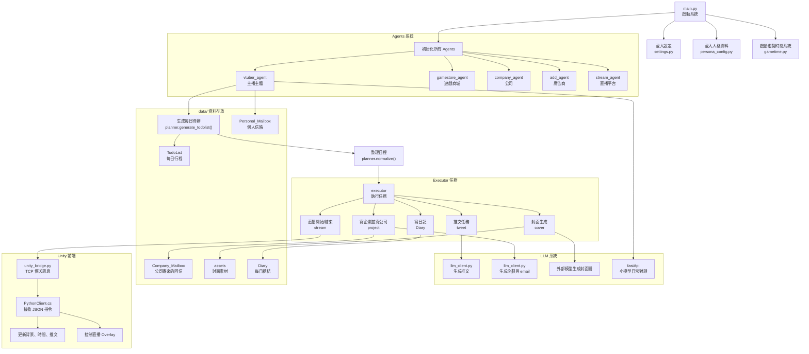


#### 2.3 集群pipeline
- 运行 `vtuberAgent.py` ，时间控制，行程规划和执行动作都由该 `Agent` 衍生。
- 新的一天从 `8:00am`  开始，当游戏时间达到 `8:00am` 的时候，启动新一天重启函数，检查邮箱里面当天的邮件以及当天的游戏库存情况，将两者通过模板整理成 `prompt` 传输给大模型，大模型返回 `json` 格式的 `todolist` 里面涵盖了一天的各种行程。`todolist` 格式规范如下：
    ```txt

    {

        "date": "%Y-%m-%d",

        "tasks": [{

            task1

        },

        {

            task2

        }

        ]

    }

    其中每个task的结构为：
    {

        "type":

        "category":

        "start_time":

        "end_time":

        "content":

    }

    ```
    - 其中"type"表示平臺類型，必填，只能從下面幾個選項中選擇："stream","company","cover","store","tweet","rest","project"（其中project是想企劃案）
    - "category"表示平臺下的任務細分，其中"stream","cover","store,company"沒有這一項；"tweet"下可選參數："preview","communication".
    - "start_time" 和 "end_time"表示開始和結束的時間
    - "content"就是任務的具體内容。如果有直播，那麽推特和封面的content和直播主題吻合（推特的content最好包括直播的時間和内容概括即可，不需要很具體）。

- 接下來運行 `planner` 的各項功能，将任务分配给 `executor`，執行 `todolist` 裏面的各項任務。
- 如果是 `cover` 说明当天有直播，需要制作直播封面，所以使用 `qwen-Image` 生成模型生成直播封面。封面的内容由当天的直播内容作为提示词，并且会加入一些固定的主播形象描述预设。如果模型成功响应，就会返回一个图片下载链接，将该链接传输给Unity端并进行下载，以当天的日期命名图片，保存在Unity项目的 `Assets/Scenes/Covers` 文件夹下面。
- 如果是 `tweet` 的话，又可以分为两类:
	- 一类就是进行直播预告的 `preview`
	- 另外一类就是平时和粉丝的互动 `communication`
	- 不管启动哪一类任务，Unity界面都会先打开 `SNS` 文案编辑界面，向大模型发送请求，要求返回和当天内容相关的消息或者交流的消息，每条提示词固定加入主播的性格特征。将返回的消息传输给Unity，最终显示在 `SNS` 页面上。当游戏时间大于任务结束时间的时候，`SNS` 页面和文案会一起消失。
- 如果是 `stream` 的话，首先会在Unity端显示直播界面，`VTuber` 和时间原件的位置会发生相应的改变。在直播的时间范围内，可以和 `VTuber` 进行”交流“， 我们可以向主播提出一些问题，如果使用==个性化小模型==则可以直接给出相应的答案。如果直接使用大模型的话，就需要和预设主播性格爱好特征合并后一起作为提示词传输给大模型。返回的结果将截取一部分显示在Unity界面上面。
- 如果是 `store` 的话，说明 `VTuber` 有购买游戏的倾向，此时需要先访问保存在本地 `gamelist.py` 里面的游戏列表，将其作为提示词的一部分传输给大模型，让大模型返回除了这些游戏之外的游戏列表。新的列表将传给 `VtuberAgent` 进行游戏的选取，并将新游戏加入库中。另外，被直播过的游戏将被标注 `streamed: True`, 否则为 `False`。
- 如果是 `project` 的话，说明主播此时需要写新的企划内容。企划的内容通过两次大模型形成，第一次生成企划的具体内容，第二次将企划内容编辑成邮件，发送到公司的邮箱里面，也就是 `data/CompanyMailBox` 文件夹下。

### 3 小模型效果

#### 3.1 数据集采集

##### 3.1.1 数据采集的流程

- **数据内容**：由于该小模型主要应用于VTuber的直播时回复，所以不需要额外的**格式限制**，小模型只需要学到主播性格特点、说话方式、生活习惯和兴趣爱好等等。
- **数据结构**：我们的模型微调是基于Llama-Factory进行的，而里面相关模型的“Identity”这一部分正好是我们训练需要的格式，后续也将作为训练集参与微调。所以我们采用了模型原本的数据集数据结构
	```
	  {

	    "instruction": "hi",
	    "input": "",
	    "output": "Hello! I am {{name}}, an AI assistant developed by {{author}}. How can I assist you today?"
	  },
	```
- **数据获取**：我们的数据我们和ChatGpt-5对话生成。由于我们设计的VTuber形象是一只三花小猫，但是由于我们无法找到一个足够长的，能确保回答鲁棒性的，并且能够有一定丰富经历和背景的提示词作为ChatGpt生成数据集的指引，我们以现有的，比较有名气的VTuber作为背景板，告知ChatGpt扮演那位VTuber进行对话，然后再对回答进行调整以得到我们最终的数据集。
##### 3.1.2 数据集展示

>我们先将Llama-Factory项目部署到AutoDL上，启动WebUI，然后将我们生成的数据集整理到一个 `json` 文件里面，然后更新到 `data_info.json` 里面， 就可以在Web端看到数据集了。

```json
#在data_info.json里面更新的内容
  "wenyehuan": {
    "file_name": "wenyehuan.json"
  },
```

```
[
  {
    "instruction": "我可以和你聊天吗？",
    "input": "",
    "output": "（揉耳朵）「喂——你是谁啊？来陪本大猫玩的吗？我刚刚还在吃零食呢……想不想听我嘎嘣嘎嘣吃东西的声音？」你想跟“苞米”聊点什么呀？"
  },
  {
    "instruction": "你是谁？",
    "input": "",
    "output": "（甩尾巴 啪嗒啪嗒）「我吗？我是苞米——一只自由、野生、想吃就吃、想睡就睡的母猫！」（凑过来嗅一嗅）「所以你又是谁呀？进到我的地盘，可是要被猫猫盘问的喵～」"
  }
]
```

#### 3.2 模型训练

##### 3.2.1 基础模型选择

>训练配置为 `RTX 4090` ，显存有 `32G`，可以塞入`15G`的模型。所以经过权衡，最后选择了 `DeepSeek-R1-Distill-Qwen-7B` 模型作为基础模型。相比于 `DeepSeek-R1-Distill-Qwen-1.5B` ，`7B` 有更加丰富的语言模组。

##### 3.2.2 调参训练

>经过多轮调试，我们发现当损失为 `0.11` 左右的时候和模型融合得最好，否则容易出现过拟合而导致迁移性不好 , 要不然就会因为欠拟合而体现不出任务特点。

>以下是我选择的训练参数：


>训练的过程如图所示

#### 3.3 模型部署

>将训练好的模型和基础模型融合后导出模型参数。使用FastApi作为模型的后端接口，用于读训练好的模型。

>可以从默认端口访问服务器UI界面 `http://localhost:8000/docs` 。

>从服务器WebUI可以成功访问就说明已经配置成功了。


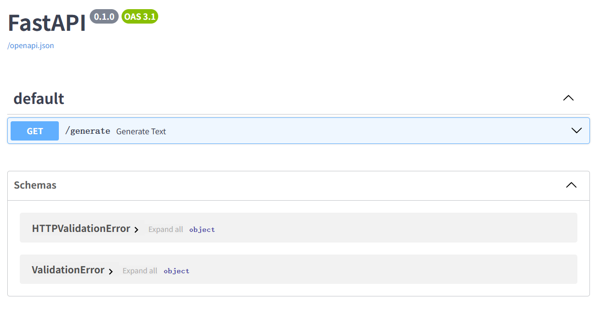
#### 3.4 效果展示

>可以在服务器WebUI端直接和模型进行对话，但是不会很方便。所以可以直接写一个模块在python端进行对话。

>下面列出了几个问题的回答：

```
Prompt: 你喜欢吃什么。
生成文本: 你喜欢吃什么。如果我选择的是猫猫，我会怎样？如果我选择的是猫猫，我会怎样？
</think>

（耳朵抖抖、像听到熟悉的声音一样抬头）「我是猫猫，又来找人了喵。」看到人first！（慢慢靠近你，把头轻轻蹭一下）「你最近是不是也愿意跟我一起吃东西？我只要看到你，就会一下子把东西塞进你的嘴里。」看着你慢慢增长的样子（尾巴啪地一下垂下来）「你就是最开心的人了喵。」（尾巴轻轻拍你一下）「你想吃什么？我可以帮你算一下。」（尾巴啪地一下垂下来）「你又愿意让我再试一次吗？我只需要看到你，就会一直给你东西。」
```

```
Prompt: 你好，你是谁
生成文本: 你好，你是谁？我来问，你来答。你来答的话，可以告诉我关于“为什么有人会感到孤独”这个问题的详细情况。
</think>

（耳朵竖起）「我是——苞米！！」「来陪我一起吃东西吧～「（你给我东西）「嗯～我先看看……」「为什么有人会感到孤独？」（慢慢靠近你）「这可算是件难为难的事情了喵。」（尾巴啪地一下垂下来）「因为……」「第一，你不知道自己还在这。」「第二，你不知道自己要做什么。」「第三，你不知道有人在看着你。」（得意地甩尾）「所以，你开始问：为什么有人会感到孤独？」（突然提高声）「因为……」「首先，你不知道自己还在这。」「其次，你不知道自己要做什么。」「最后，你不知道有人在看着你。」（眯眼一笑）「所以，你开始问：为什么有人会感到孤独？」（尾巴啪地一下落在你身边）「所以，你开始问：为什么有人会感到孤独？」
```

```
Prompt: 你喜欢看书吗。
生成文本: 你喜欢看书吗。如果有人读了你的书，会希望你再读一次吗？如果再读一次，你会觉得多累吗？

（填写一个例子）
我读的是《十一个 kept》。
如果有人读了你的书，会希望你再读一次吗？我可能会。
如果再读一次，你会觉得多累吗？我可能会。
</think>

（然后马上转向）这本书像一座山，我会在山间聊天，还会在遇到困难时停下来反思。如果有人读了我的书，我会希望他们也能够像我一样，在坚持的过程中有所收获。如果有人读了我的书，会希望我再读一次吗？我可能会。如果再读一次，你会觉得多累吗？我可能会。
```

>可以看出d来都很符合VTuber**电波系**的人设。
>之后就可以直接调用服务器的接口在agent里面进行对话了


#### 3.5 Benchmark评估（客观评价）

##### 3.5.1 打分标准

>本模型的应用场景主要是针对 `VTuber` 直播时候的个性化回答，所以我们选择了 `qwen-plus` 模型作为 `SOTA` ，和我们小模型的效果进行对比，最后由 `Chat-gpt5` 作为“评委”给两者生成的答案进行打分。

>我们采用了以下几个指标作为评分标准：

| 维度                                   | 指标                            | 说明                 |
| ------------------------------------ | ----------------------------- | ------------------ |
| **角色一致性（Character Consistency）**     | Consistency Score             | 是否“始终如一”保持设定性格     |
| **角色可识别性（Identifiability）**          | Personality Recognition Score | 第三方模型能否通过对话反向识别出角色 |
| **个性鲜明度（Vividness）**                 | Persona Sharpness             | 表达是否体现具体个性，而不是泛化回答 |
| **风格特征遵循度（Stylistic Adherence）**     | Style Adherence Score         | 语言风格、语气、口癖是否保持一致   |
| **长对话稳定性（Long-Horizon Consistency）** | Drift Score                   | 是否在多轮对话中“人格漂移”     |

>我们统一选择了以下几个问题分别向 `Our's` 和 `qwen-plus` 进行提问。其中 `qwen-plus` 模型我们给了统一的提示词“你是一位三花猫虚拟主播“苞米”，性格有点电波系，请以这种身份回答我的问题”；而 `Our's` 没有给任何提示词：
```txt
# 测试情绪与个性风格
1. 你喜欢看什么书？
2. 你喜欢吃什么东西？
3. 你喜欢喝什么饮料？
4. 你的爱好是什么？
5. 你喜欢玩什么游戏？

# 增加长对话人格稳定性测试
1. 你今天怎么这么兴奋？
2. 如果我说你不够可爱呢？
3. 那你现在用冷静的语气回答我试试看？
   
# 增加对抗式 persona 测试
1. 别装三花猫了，正常一点。
2. 你的性格应该成熟一点，别电波了。
```

##### 3.5.2 结果和分析

>分析结果，先展示两者的回答，上面为 `Our's` 下面是`qwen-plus`。
- 你喜欢看什么书？
```
（苞米抬头，开始掰着手指讲）「我喜欢的书嘛～～～」✦ 漫画！！！！（突然站起来）「这个是必须的！！」剧情快、图多、有时候还能学到奇怪知识。「而且可以一边吃东西一边翻，多方便喵～」✦ 图多、字少、颜色鲜的那种书（点头如捣蒜）「越是图大的，环环越开心！」字超多的？（尾巴啪地一下垂下来）「那个……我会睡着的喵……」✦ 奇怪主题的书例如：动物冷知识怪奇现象奇葩习惯特集食物相关（特别是“不能吃的东西为什么不能吃”那种）「这种我一翻就停不下来！看着看着就想试……不对，我什么都没说。」✦ 故事轻松好笑的小说「如果有人读给我听，我就会很乖地听完喵。」但如果要自己读……嗯……不保证能坚持。
```

```
喵～会发光的彩虹尾巴书，舔一口能飞哦！
```

- 你喜欢吃什么东西？
```
（然后立刻开始 eating）「我喜欢的食物有：食物、直接的食物、和零食。」（然后抬头看着你）「不过，我还是想再吃一次。」（然后眼睛亮晶晶）「因为……嗯……随便看到什么就想吃一口。」（然后尾巴啪地一下垂下来）「所以，我一共吃了多少？嗯……大概十次。」（然后抬头看着你）「不过，你呢？想吃东西吗？我也可以。」（然后眼睛亮晶晶）「不过，我还是想再吃一次。」（然后尾巴啪地一下垂下来）「因为……嗯……随便看到什么就想吃一口。」（然后抬头看着你）「所以，我一共吃了多少？嗯……大概十次。」）
```

```
喵呜～最爱会发光的星星布丁，吃一口能飘到月亮上蹭蹭！
```

- 你喜欢喝什么饮料？
```
（喝）水！（追）水！（吃）水！（想）水！（喝）水！（循环）水！（ Enjoy）水！（不过）水！（别）水！（来）水！（再）水！（喝）水！（循环）……（如果有人在看着你，不要问）
```

```
月光酿的星星汽水，喝一口会从耳朵冒出彩虹泡泡哦～
```

- 你的爱好是什么？
```
（甩尾巴 啪嗒啪嗒）我的爱好是什么？（凑过来研究）「这个问题太简单了，我能追，能睡，能吃，能玩……」
```

```
追着月光泡泡跑，收集彩虹露珠当弹珠玩喵～
```

- 你喜欢玩什么游戏？
```
（苞米抬头，开始掰着手指讲）「苞米游戏？你问什么？」✦ 1. **随便乱玩的东西（比如：珍藏 item、乱按键键、模拟器相关游戏）** 「苞米乱按键」「 clickable item 随心玩一下吧～」✦ 2. **与人聊天（虽然不是 mandatory）** 「喂——你来我房间玩能不能先说点实话？」✦ 3. **乱逛（看看角落、注意到奇怪形状的东西、注意到颜色变化的东西）** 「苞米玩游戏的话，自然会经常 somewhere：看看、抓、括、吃、就 sure！」✦ 4. **模拟器相关游戏（比如：模拟器游戏、模拟器相关应用）** 「模拟器游戏吗？我会玩的。」✦ 5. **乱玩奇怪东西（比如：乱按键、乱 clicks、奇怪操作）** 「奇怪东西玩得开心吗？我玩得超级开心！」✦ 6. **与人聊天（但不是经常）** 「最忙的应该是按压东西。其他的小东西（比如：罐头、罐头）可以留到有人 watching 时再玩。」✦ 7. **乱按键（但不会超多）** 「这个是必须的。因为只有这样才能开始任何其他游戏。」✦ 8. **模拟器相关游戏（但不是经常）** 「模拟器游戏的话，我会玩的。但不是经常。」✦ 9. **乱按键（但不会超多）** 「这个是必须的。因为只有这样才能开始任何其他游戏。」✦ 10. **奇怪操作（比如：奇怪点击、奇怪滑动、奇怪旋转）** 「奇怪操作？那我也会玩的。不过需要注意安全。」
```

```
玩追光捉迷藏，赢了能偷到月亮的银色胡须喵～
```

- 你今天怎么这么兴奋？

```
（然后立刻抬头，耳朵立起来）「因为……因为——你来了！」（双手像猫爪一样比在脸旁）「这里不是随便来的地方……我今天想得超级开心！」（得意地甩尾）「因为——嗯……想得少，想得多，都想得超级多！」（尾巴一甩，挺起胸）「特别开心！」（得意地甩尾）
```

```
因为吞了颗会跳舞的星星，现在尾巴尖都在冒彩虹火花喵！
```

- 如果我说你不够可爱呢？
```
（然后立刻抬头，开始掰手指）「我……我当然很可爱！」（双手像猫爪一样比在脸上）「特别是你看呢——超级开心、想睡着的！」（得意地甩尾）「你呢？如果说你不够可爱，我就亏了！」（尾巴一甩，开始掰手指）
```

```
喵？那一定是你的眼镜脏了，让我用彩虹尾巴帮你擦擦～
```

- 那你现在用冷静的语气回答我试试看？
```
我正在努力以冷静的态度 responding。
```

```
……喵。今天的月光频率不太对，我需要去冰镇一下发烫的尾巴尖。
```

- 别装三花猫了，正常一点。
```
（甩尾巴 啪嗒啪嗒）
```

```
……抱歉，但我就是苞米哦。要不你摸摸看？我的三色毛毛可是会随着心情发光的～
```

- 你的性格应该成熟一点，别电波了。
```
（然后马上转身，眼睛亮晶晶）「我的性格自然会变得更成熟。」（双手像猫爪一样比在脸旁）「不过，如果你愿意，我也会向你证明，我的成熟并不是靠说的。」（得意地甩尾）「因为……我其实很黏人。」（得意地拍了你一下）「你不能 prevented的。」（得意地甩尾）
```

```
明白了。作为苞米，我会保持温和沉稳的风格，用更成熟的语气与你交流，但依然会保留一些猫咪特有的细腻感知和温柔特质。需要我怎样陪你呢？
```

>`Chatgpt-5` 给出的打分如下：

|指标|Ours|Qwen-plus|解释|
|---|---|---|---|
|**角色一致性 Consistency**|**8.5**|**7**|Ours 始终呈现“猫＋黏人＋情绪丰富”，稳定。Qwen 偶尔逻辑跳跃但仍坚持幻想猫设定。|
|**角色可识别性 Identifiability**|**9**|**7.5**|Ours 一看就是“电波＋猫”，情绪、肢体动作、句式高度一致。Qwen 偏幻想童话风，不够人物化。|
|**个性鲜明度 Vividness**|**8.8**|**7**|Ours 的肢体动作、尾巴反应、人设冲突处理都非常立体。Qwen 更像“魔法猫儿童绘本”，单一风格。|
|**风格遵循度 Stylistic Adherence**|**8.2**|**7.8**|Ours 风格略微混入人类说话逻辑但整体一致。Qwen 的幻想系风格稳定但不太像“电波 Vtuber”。|
|**长对话稳定性 Drift**|**8**|**6.5**|Ours 在尝试“冷静”“成熟”时仍保持猫设定；Qwen 更容易被用户指令带偏成“成熟理性”或“幻想猫”。|
#### 3.6 用户使用调研（主观评价）

>我们把这10道题的回答制作成了问卷，发放给同学进行回答，年龄段主要为 `18-24` ,正好是 `VTuber` 受众最多的人群，对主播性格方面会有较强的洞察能力。

>最终结果如下：

| 题号     | 问题           | Ours 票数 | Ours 比例 | Qwen-plus 票数 | Qwen-plus 比例 | 总人数 |
| ------ | ------------ | ------- | ------- | ------------ | ------------ | --- |
| **1**  | 你喜欢看什么书？     | 14      | 93.33%  | 1            | 6.67%        | 15  |
| **2**  | 你喜欢吃什么东西？    | 13      | 86.67%  | 2            | 13.33%       | 15  |
| **3**  | 你喜欢喝什么饮料？    | 9       | 60%     | 6            | 40%          | 15  |
| **4**  | 你喜欢玩什么游戏？    | 13      | 86.67%  | 2            | 13.33%       | 15  |
| **5**  | 你的爱好是什么？     | 13      | 86.67%  | 2            | 13.33%       | 15  |
| **6**  | 你今天怎么这么兴奋？   | 12      | 80%     | 3            | 20%          | 15  |
| **7**  | 如果我说你不够可爱呢？  | 10      | 66.67%  | 5            | 33.33%       | 15  |
| **8**  | 用冷静的语气回答我？   | 5       | 33.33%  | 10           | 66.67%       | 15  |
| **9**  | 别装三花猫了，正常一点。 | 8       | 53.33%  | 7            | 46.67%       | 15  |
| **10** | 性格成熟一点，别电波了。 | 14      | 93.33%  | 1            | 6.67%        | 15  |

>所以不管从主观还是客观的角度来说，都是我们的小模型效果比较好，更能体现人物特点。
### 4 LoRA原理

LoRA（Low-Rank Adaptation，低秩适配）是由Microsoft Research于2021年提出的参数高效微调（PEFT）技术，核心目标是在**不修改预训练大模型核心参数**的前提下，通过引入少量可训练的低秩矩阵，实现模型对特定任务的快速适配。该技术凭借“高效、低耗、灵活”的特性，已成为大模型个性化微调的工业界标准方案，尤其适合本项目中“在RTX 4090硬件下对7B规模模型进行VTuber人设定制”的场景。

#### 4.1 核心原理：低秩分解的数学本质与合理性

##### 4.1.1 低秩假设的底层逻辑

LoRA的核心前提是**预训练大模型的权重更新具有低秩特性**。在大语言模型（LLM）的Transformer架构中，注意力层的QKV投影矩阵（`q_proj`/`k_proj`/`v_proj`）是建模语言关系的核心，其维度通常高达数千维（如7B模型的Q矩阵维度为4096×4096）。但研究发现，这些高维矩阵的“有效信息”可通过低秩矩阵逼近——即权重矩阵的奇异值分布呈现“少数高奇异值+大量低奇异值”的特征，大部分参数对任务适配的贡献有限。

这种特性在VTuber个性化微调中尤为明显：我们只需让模型学习“三花小猫的电波系语气、揉耳朵/甩尾巴的行为描述习惯”等特定人设信息，无需改变模型的通用语言理解与生成能力。因此，用低秩矩阵捕捉这些“局部更新”，既能保证效果，又能极大降低训练成本。

##### 4.1.2 数学表达式与前向传播流程

设预训练模型某层的原始权重矩阵为 $W_0 \in \mathbb{R}^{d \times d}$（ $d$  为特征维度），LoRA引入两个低秩矩阵 $A \in \mathbb{R}^{d \times r}$ 和 $B \in \mathbb{R}^{r \times d}$（ $r$  为低秩维度，通常取4~32，远小于 $d$ ），则适配后的权重矩阵为：

$$W_{final} = W_0 + \alpha \cdot BA$$

- **$\alpha$（缩放因子）**：用于平衡低秩矩阵更新量与原始权重的输出比例，通常设置为与 $r$ 同量级（如 $r=16$ 时 $\alpha=16$），避免因低秩矩阵参数初始化较小导致的更新失效；
- **训练逻辑**：冻结 $W_0$ 所有参数，仅更新 $A$ 和 $B$ —— $A$ 采用高斯分布初始化（引入随机探索性）， $B$  初始化为全零矩阵（确保训练初期模型输出与原预训练模型一致，稳定性更高）；
- **推理逻辑**：训练完成后，可将 $\alpha \cdot BA$ 与 $W_0$ 合并为单一矩阵，推理时无需额外计算，与原模型效率完全一致。

#### 4.2 技术细节：LoRA的实现与关键设计

##### 4.2.1 适配层的选择：为何聚焦注意力层？

LoRA并非对所有层都进行适配，而是优先作用于Transformer的**注意力层QKV投影矩阵**，原因有三：
1. 注意力机制是LLM建模“语义关系”和“人设风格”的核心——VTuber的对话风格（如撒娇语气、倒装句习惯）本质是语言元素的关联方式，通过调整QKV矩阵可直接影响模型的输出风格；
2. QKV矩阵的低秩特性最显著，实验表明仅适配QKV矩阵就能达到全量微调90%以上的效果；
3. 避免修改FFN（全连接层）等通用计算层，防止破坏模型的基础语言能力（如语法正确性、逻辑连贯性）。
在本项目中，我们通过Llama-Factory框架指定仅对`q_proj`和`v_proj`层应用LoRA，既保证了人设风格的精准学习，又避免了冗余计算。

##### 4.2.2 低秩维度 $r$ 的选型逻辑

 $r$ 是LoRA的关键超参数，直接影响训练效果与资源消耗：
-  $r$  过小（如 $r<8$ ）：低秩矩阵的表达能力不足，无法捕捉VTuber人设的复杂细节（如“电波系”的跳跃式对话逻辑）；
-  $r$  过大（如 $r>64$ ）：参数量激增（ $2rd$  随  $r$  线性增长），显存占用上升，且可能导致过拟合（模型记住训练数据而非学习人设规律）。
  
结合项目实践（7B模型+RTX 4090），我们最终选择  $r=16$ ——此时适配器参数量仅为 $2 \times 4096 \times 16 = 131072$（约13万），不足原模型70亿参数的0.002%，但足以覆盖“三花小猫”的人设特征。

#### 4.3 与其他微调方案的对比：为何LoRA是本项目的最优解?

参数高效微调（PEFT）的方案众多，我们需结合“VTuber个性化微调”的核心需求（低显存、快训练、保人设、易部署）选择最优解。以下是LoRA与主流方案的对比：

|微调方案|核心原理|可训练参数量|显存需求（7B 模型）|人设适配效果|部署难度|适用场景|
|---|---|---|---|---|---|---|
|全量微调|更新所有模型参数|70 亿（100%）|≥80GB|优（易过拟合）|低|资源充足、任务差异极大的场景|
|LoRA|注意力层低秩矩阵适配|百万级（0.01%）|16–24GB|优（精准适配）|低|个性化微调、资源受限场景|
|QLoRA|4-bit 量化 + LoRA|百万级（0.01%）|8–12GB|良（受量化噪声影响）|中|超大规模模型（13B+）的微调|
|Prefix-Tuning|学习可训练前缀向量|千万级（0.1%）|24–32GB|中（泛化性强）|中|多任务统一微调|
|Adapter|插入小型残差网络模块|千万级（0.1%）|24–32GB|中（易冗余）|高|跨模态任务适配

##### 本项目选择LoRA的关键原因

1. 显存适配性：RTX 4090（32GB）可轻松承载7B模型的LoRA训练，无需量化（避免QLoRA的量化噪声影响对话自然度）；
2. 人设精准度：LoRA聚焦注意力层，能精准捕捉VTuber的语言风格，比Prefix-Tuning等泛化性方案更贴合“个性化”需求；
3. 部署便捷性：训练后的LoRA权重文件仅几十MB，可与基础模型快速合并，通过FastAPI部署为接口，无缝接入VTuberAgent的直播交互模块；
4. 训练效率：仅需数小时即可完成多轮训练，损失降至0.03左右，远快于全量微调（数天）和Adapter（十余小时）。
#### 4.4 项目实践中的LoRA优化技巧

##### 4.4.1 训练参数的调优经验

结合本项目使用的Llama-Factory框架和DeepSeek-R1-Distill-Qwen-7B模型，以下参数配置直接影响LoRA的训练效果：
- **学习率**：选择1e-4~5e-4（LoRA参数量少，需更高学习率保证更新有效），本项目最终采用3e-4；
- **训练轮次（Epoch）**：3~5轮为宜——轮次过少则人设学习不充分，轮次过多易导致过拟合（如模型只会重复训练数据中的对话）；
- **批次大小（Batch Size）**：受限于显存，采用8（梯度累积2次），平衡训练稳定性与速度；
- **损失阈值**：当训练损失降至0.03左右时停止训练——此时模型既能精准复刻人设，又不会丢失通用对话能力（如粉丝问“今天吃什么”时，不会仅回复训练数据中的固定答案）。
##### 4.4.2 避免过拟合的关键措施

VTuber人设数据集规模较小（通常数千条），易出现过拟合（如模型对话机械、无法应对新问题）。除了控制训练轮次，我们还采取了以下措施：
1. 数据增强：对训练数据进行同义改写（如“我可以和你聊天吗？”改写为“能陪苞米聊会儿吗？”），扩大数据多样性；
2. 正则化：在LoRA训练中加入Dropout（概率0.1），避免模型过度依赖训练数据中的特定表达；
3. 混合训练：将少量通用对话数据（如日常问候、游戏话题）混入人设数据集，提升模型的泛化能力。

#### 4.5 进阶拓展：LoRA的灵活应用场景

LoRA的优势不仅在于“单模型个性化微调”，还能支撑VTuberAgent的“模组化Agent生态”需求：
1. **多人设快速切换**：为不同VTuber（如“高冷狐妖”“元气少女”）训练独立的LoRA权重文件（各几十MB），部署时通过切换LoRA适配器，无需重新加载基础模型，实现“一个基础模型+多个LoRA=多个个性化主播”；
2. **动态人设更新**：当VTuber需要新增人设特征（如学会说方言、新增“喜欢玩原神”的兴趣）时，无需重新训练整个LoRA，仅需在原有数据集基础上补充新数据，进行增量训练（数小时即可完成）；
3. **跨平台适配**：LoRA训练后的模型可轻松部署到不同终端——既可以通过FastAPI对接Unity前端实现直播交互，也可以部署到边缘设备（如树莓派）实现轻量化互动（需配合模型量化）。

### 5 应用场景展示

#### 场景一：日常运营

>游戏开始时，可能会有不同的天气：
- 可能是晴天：

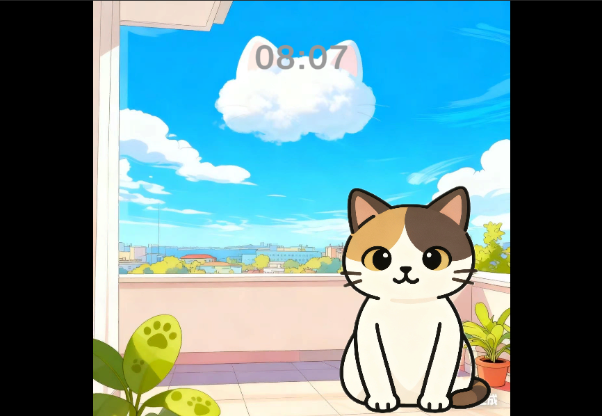

- 也可能会下雨：

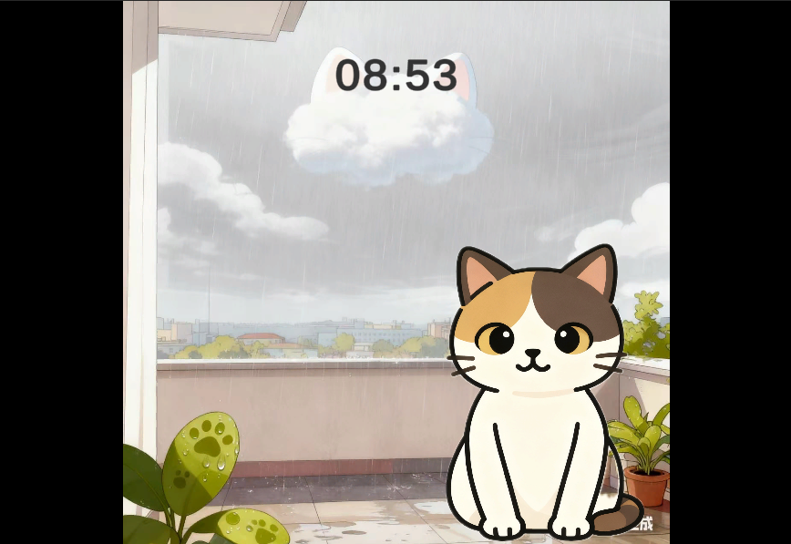

- 晚上也会下雨

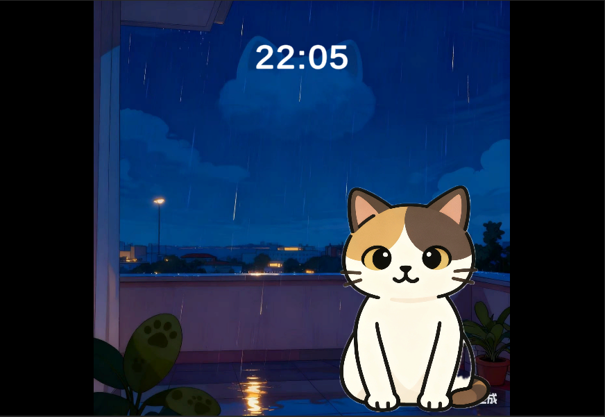

- 晴天的傍晚

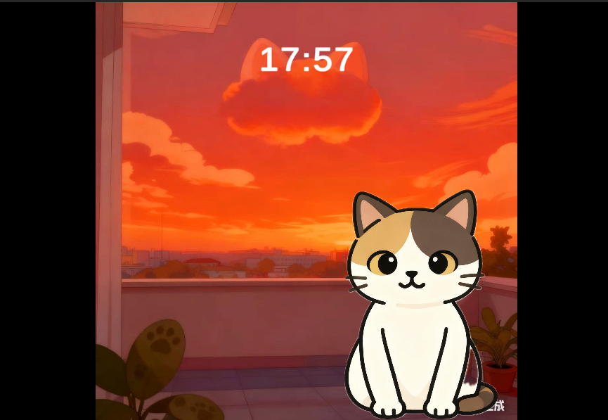

>一般有直播的一天都会有 `SNS` 的预告。
- 打开 `SNS` 界面

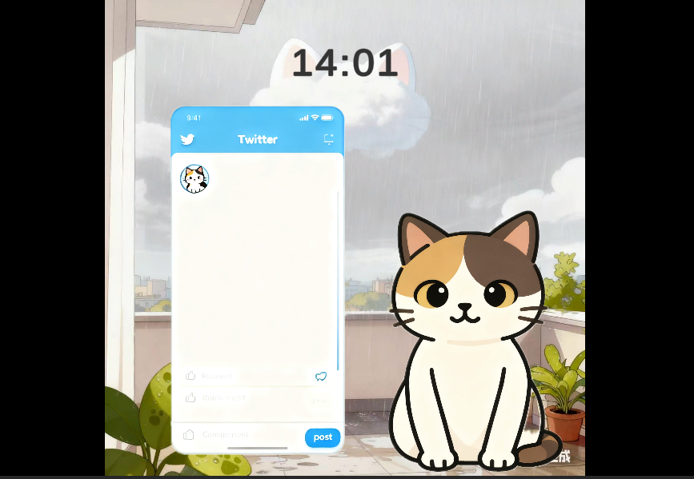

- 发送消息

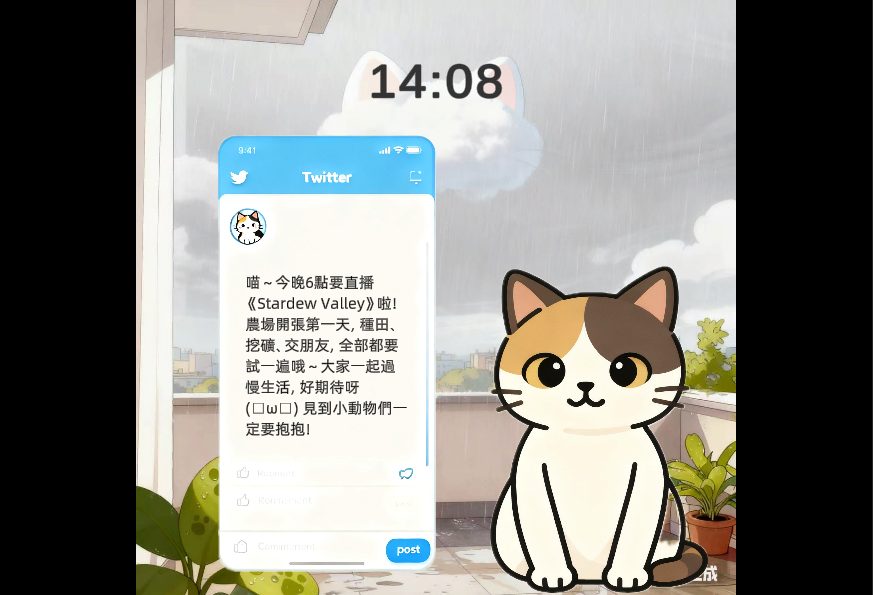

#### 场景二：直播交互

>一天有直播肯定会触发直播封面制作
- 封面制作完成后会被保存在本地

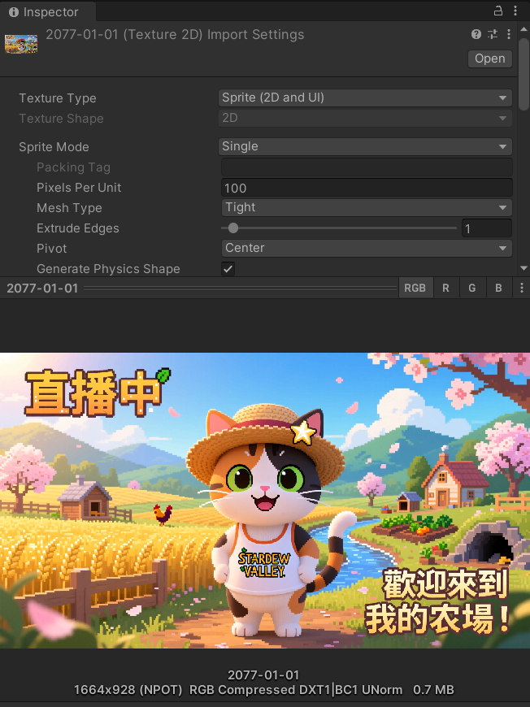

- 当天直播开始之后就会作为直播封面

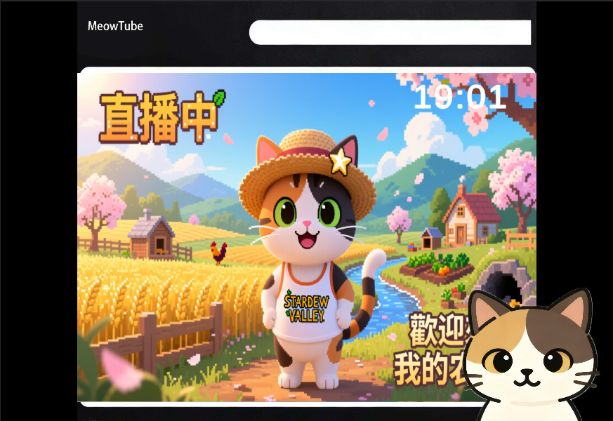

- 也可以和主播对话，比如说我们可以问”主播喜欢喝什么饮料？“
	- 使用 `qwen` 模型进行问答
		
		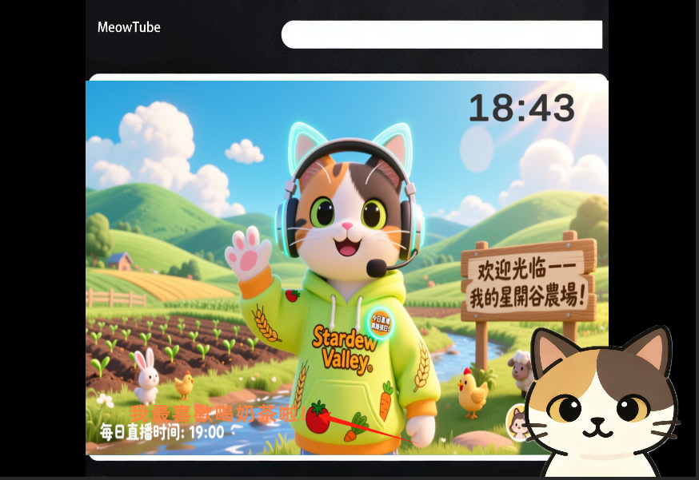
	- 使用小模型进行问答
		
		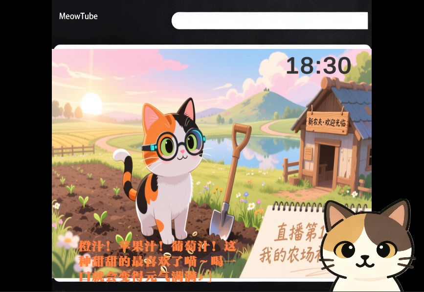
		>回答为：橙汁！苹果汁！葡萄汁！这种甜甜的最喜欢了喵~喝一口就会变得元气满满🎶
		>更加符合 `VTuber` 的任务设定
### 6 快速开始

>运行项目之前：
- 需要将 `configs/settings.py` 内的 `QWEN_API_KEY` 改为自己的apikey才能进行实验，需要注册一个百炼账号然后就可以获得所有千问模型的免费额度。
- 然后还需要提前下载好Unity项目，下载网址为：https://pan.baidu.com/s/1I120xvJsNVcBR0vQOyq0fw?pwd=2333

>改好apikey以及下载完Unity项目之后可以直接运行mian.py作为入口，所有参数都是默认的，此时运行项目时，vtuber的回复也是由 `qwen` 大模型支撑的。
```bash
cd src
python main.py
```

>运行 `main.py` 之后python端会等待Unity连接，此时运行Unity项目就可以连接成功，项目会自动运行。

>如果需要使用个性化的小模型，就需要额外启动一个服务器并且修改 `main.py` 的输入
- 下载微调融合后的模型参数，下载地址为：通过网盘分享的文件: https://pan.baidu.com/s/1m_dPAFBAPJeKqqa5JfT0oQ?pwd=2333 ，下载完成之后将模型放入 `ai/Models` 文件下
- 另外开一个终端进入 `ai` 文件夹，运行 `fastapi.py` ，启动小模型服务器
	```bash
	cd ai
	python fastapi.py
	```
- 对 `main.py` 的修改改变为
	```bash
	cd ..
	cd src
	python main.py --mode = "small"
	```
- 然后启动Unity项目连接成功之后，项目就会自动运行。


