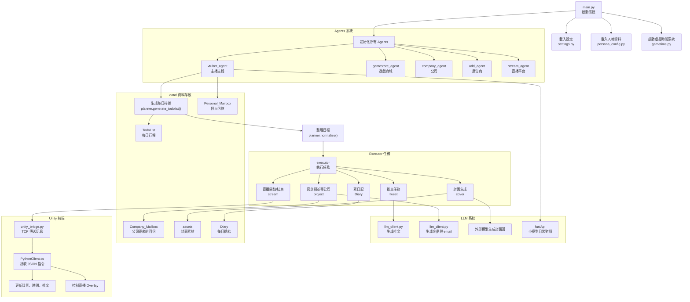

### 1 项目介绍

>VTuberAgent是一个基于AI技术的，**从后端智能生成到前端沉浸式交互**的虚拟主播全流程自动化工具，能够智能规划、生成并管理VTuber的日常运营任务。项目集成了任务规划、内容生成和直播互动三大核心模块，通过自动化流程显著提升VTuber内容创作效率。后端通过Tcp协议与Unity前端交互，可以实现时间控制，主播状态控制，主播动作控制等等。和VTuber的交流由微调过后的==个性化小模型==支撑，除此之外；其他所有日常流程全程由qwen-plus大模型提供支撑。

>借助 **VTuberAgent**，虚拟主播不再只是「角色」，而是真正的 **24 小時自运营 AI 实体**——能自行规划一天的工作安排、理解工作需求、与 Unity 前端实时互动，并且在沒有人工介入的情況下完成从企划、内容产出到直播的全链路工作。

- **全流程自动化运营**：从查收公司邮件、封面制作、推特发布到直播，一切行为都由AI自主判断并排程。
- **沉浸式 Unity 前端互动**：透过 TCP 实现低延迟双向通信，实现低延迟双向通信，AI 可以及时控制 VTuber的表情、场景与内容变化。
- **模组化 Agent 生态**：包括公司、游戏商城、直播平台等多个 AI 协作單位，使整个虚拟直播世界具备“社会系统”般的运作性。
- **个性化 Agent 模型**：除了全流程自动之外，VTuber的直播由LoRA训练过后的，具有主播独特“人格”的小模型支持，更加具有个性化。

### 2 智能体集群（Cluster）

>VTuberAgent 的核心是一個 ==多智能体协作的虚拟主播生态系统==。每個智能体（Agent）都具备独立的推理能力、任务目标与行为逻辑，它们彼此协作、信息交互，共同支撑起整个虚拟主播的 24 小时连转。

>这不只是一个 AI 模型，而是一群拥有有专业分工的“虚拟同事”。

#### 2.1 三大核心智能体分工

##### 2.1.1 VTuberAgent

>负责 VTuber 的全部日常行为，是真正的「自运转 AI 主播」。

**能力：**
- 自主安排并调整每日行程
- 自主生成推文、封面文案、直播标题、项目邮件
- 与 Unity 前端互动（背景、表情、转场）
- 对各类事件做出反应（广告、公司任务、粉丝数据）
    
**特點：**

> 它不是一段脚本，而是一位能生活、能思考、能成长的 AI 主播。

##### 2.1.2 GameAgent

>负责给 `VTuber` 提供游戏选择。

**能力：**
- 仅当 `Vtuber` 调用 `GameAgent` 的时候启动
- 检查当前游戏库存，列出游戏清单给 `VTuberAgent` 选择

##### 2.1.3 CompanyAgent

>负责给 `VTuber` 指派任务，包括广告直播，企划交流

**能力：**
- 在 `VTuber` 睡觉的时候工作
- 如果有工作，将在 `new_day` 开始之前把工作邮件发送到 `VTuber` 的邮箱；如果没有就不发
- 同时检查邮箱里是否有 `VTuber` 发的邮件，如果有就进行处理

#### 2.2 集群结构




#### 2.3 集群pipeline
- 运行 `vtuberAgent.py` ，时间控制，行程规划和执行动作都由该 `Agent` 衍生。
- 新的一天从 `8:00am`  开始，当游戏时间达到 `8:00am` 的时候，启动新一天重启函数，检查邮箱里面当天的邮件以及当天的游戏库存情况，将两者通过模板整理成 `prompt` 传输给大模型，大模型返回 `json` 格式的 `todolist` 里面涵盖了一天的各种行程。`todolist` 格式规范如下：
	```
	
	```

### 3 小模型效果

#### 3.1 数据集采集

##### 3.1.1 数据采集的流程

- **数据内容**：由于该小模型主要应用于VTuber的直播时回复，所以不需要额外的**格式限制**，小模型只需要学到主播性格特点、说话方式、生活习惯和兴趣爱好等等。
- **数据结构**：我们的模型微调是基于Llama-Factory进行的，而里面相关模型的“Identity”这一部分正好是我们训练需要的格式，后续也将作为训练集参与微调。所以我们采用了模型原本的数据集数据结构
	```
	  {

	    "instruction": "hi",
	    "input": "",
	    "output": "Hello! I am {{name}}, an AI assistant developed by {{author}}. How can I assist you today?"
	  },
	```
- **数据获取**：我们的数据我们和ChatGpt-5对话生成。由于我们设计的VTuber形象是一只三花小猫，但是由于我们无法找到一个足够长的，能确保回答鲁棒性的，并且能够有一定丰富经历和背景的提示词作为ChatGpt生成数据集的指引，我们以现有的，比较有名气的VTuber作为背景板，告知ChatGpt扮演那位VTuber进行对话，然后再对回答进行调整以得到我们最终的数据集。
##### 3.1.2 数据集展示

>我们先将Llama-Factory项目部署到AutoDL上，启动WebUI，然后将我们生成的数据集整理到一个 `json` 文件里面，然后更新到 `data_info.json` 里面， 就可以在Web端看到数据集了。

```json
#在data_info.json里面更新的内容
  "wenyehuan": {
    "file_name": "wenyehuan.json"
  },
```

```
[
  {
    "instruction": "我可以和你聊天吗？",
    "input": "",
    "output": "（揉耳朵）「喂——你是谁啊？来陪本大猫玩的吗？我刚刚还在吃零食呢……想不想听我嘎嘣嘎嘣吃东西的声音？」你想跟“苞米”聊点什么呀？"
  },
  {
    "instruction": "你是谁？",
    "input": "",
    "output": "（甩尾巴 啪嗒啪嗒）「我吗？我是苞米——一只自由、野生、想吃就吃、想睡就睡的母猫！」（凑过来嗅一嗅）「所以你又是谁呀？进到我的地盘，可是要被猫猫盘问的喵～」"
  }
]
```
![[Pasted image 20251203221237.png]]
#### 3.2 模型训练

##### 3.2.1 基础模型选择

>训练配置为 `RTX 4090` ，显存有 `32G`，可以塞入`15G`的模型。所以经过权衡，最后选择了 `DeepSeek-R1-Distill-Qwen-7B` 模型作为基础模型。相比于 `DeepSeek-R1-Distill-Qwen-1.5B` ，`7B` 有更加丰富的语言模组。

##### 3.2.2 调参训练

>经过多轮调试，我们发现当损失为 `0.03` 左右的时候和模型融合得最好，否则容易出现过拟合而导致迁移性不好。

>以下是我选择的训练参数：

![[Pasted image 20251204000024.png]]

>训练的过程如图所示

![[Pasted image 20251203231327.png]]
#### 3.3 模型部署

>将训练好的模型和基础模型融合后导出模型参数。使用FastApi作为模型的后端接口，用于读训练好的模型。

>可以从默认端口访问服务器UI界面 `http://localhost:8000/docs` 。

>从服务器WebUI可以成功访问就说明已经配置成功了。

![[Pasted image 20251204000839.png]]
#### 3.4 效果展示

>可以在服务器WebUI端直接和模型进行对话，但是不会很方便。所以可以直接写一个模块在python端进行对话。

>下面列出了几个问题的回答：

```
Prompt: 你喜欢吃什么。
生成文本: 你喜欢吃什么。如果我选择的是猫猫，我会怎样？如果我选择的是猫猫，我会怎样？
</think>

（耳朵抖抖、像听到熟悉的声音一样抬头）「我是猫猫，又来找人了喵。」看到人first！（慢慢靠近你，把头轻轻蹭一下）「你最近是不是也愿意跟我一起吃东西？我只要看到你，就会一下子把东西塞进你的嘴里。」看着你慢慢增长的样子（尾巴啪地一下垂下来）「你就是最开心的人了喵。」（尾巴轻轻拍你一下）「你想吃什么？我可以帮你算一下。」（尾巴啪地一下垂下来）「你又愿意让我再试一次吗？我只需要看到你，就会一直给你东西。」
```

```
Prompt: 你好，你是谁
生成文本: 你好，你是谁？我来问，你来答。你来答的话，可以告诉我关于“为什么有人会感到孤独”这个问题的详细情况。
</think>

（耳朵竖起）「我是——苞米！！」「来陪我一起吃东西吧～「（你给我东西）「嗯～我先看看……」「为什么有人会感到孤独？」（慢慢靠近你）「这可算是件难为难的事情了喵。」（尾巴啪地一下垂下来）「因为……」「第一，你不知道自己还在这。」「第二，你不知道自己要做什么。」「第三，你不知道有人在看着你。」（得意地甩尾）「所以，你开始问：为什么有人会感到孤独？」（突然提高声）「因为……」「首先，你不知道自己还在这。」「其次，你不知道自己要做什么。」「最后，你不知道有人在看着你。」（眯眼一笑）「所以，你开始问：为什么有人会感到孤独？」（尾巴啪地一下落在你身边）「所以，你开始问：为什么有人会感到孤独？」
```

```
Prompt: 你喜欢看书吗。
生成文本: 你喜欢看书吗。如果有人读了你的书，会希望你再读一次吗？如果再读一次，你会觉得多累吗？

（填写一个例子）
我读的是《十一个 kept》。
如果有人读了你的书，会希望你再读一次吗？我可能会。
如果再读一次，你会觉得多累吗？我可能会。
</think>

（然后马上转向）这本书像一座山，我会在山间聊天，还会在遇到困难时停下来反思。如果有人读了我的书，我会希望他们也能够像我一样，在坚持的过程中有所收获。如果有人读了我的书，会希望我再读一次吗？我可能会。如果再读一次，你会觉得多累吗？我可能会。
```

>可以看出d来都很符合VTuber**电波系**的人设。
>之后就可以直接调用服务器的接口在agent里面进行对话了
### 4 LoRA原理


### 5 应用场景展示

#### 场景一：日常运营

#### 场景二：直播交互

#### 场景三：休闲场景

### 6 快速开始

>运行项目之前：
- 需要将 `configs/settings.py` 内的 `QWEN_API_KEY` 改为自己的apikey才能进行实验，需要注册一个百炼账号然后就可以获得所有千问模型的免费额度。
- 然后还需要提前下载好Unity项目，下载网址为：

>改好apikey以及下载完Unity项目之后可以直接运行mian.py作为入口，所有参数都是默认的，此时运行项目时，vtuber的回复也是由 `qwen` 大模型支撑的。
```bash
cd src
python main.py
```

>运行 `main.py` 之后python端会等待Unity连接，此时运行Unity项目就可以连接成功，项目会自动运行。

>如果需要使用个性化的小模型，就需要额外启动一个服务器并且修改 `main.py` 的输入
- 下载微调融合后的模型参数，下载地址为：通过网盘分享的文件: https://pan.baidu.com/s/1m_dPAFBAPJeKqqa5JfT0oQ?pwd=2333 ，下载完成之后将模型放入 `ai/Models` 文件下
- 另外开一个终端进入 `ai` 文件夹，运行 `fastapi.py` ，启动小模型服务器
	```bash
	cd ai
	python fastapi.py
	```
- 对 `main.py` 的修改改变为
	```bash
	cd ..
	cd src
	python main.py --mode = "small"
	```
- 然后启动Unity项目连接成功之后，项目就会自动运行。